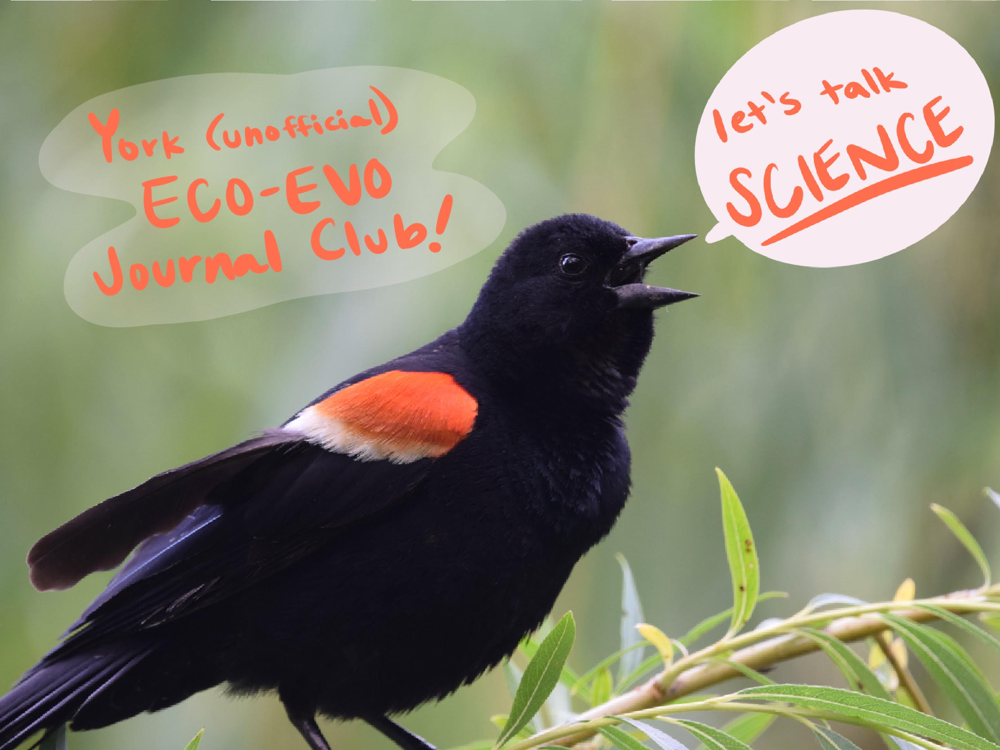

```{r setup, include=FALSE}
knitr::opts_chunk$set(echo = TRUE)
```

# York Ecology and Evolution Journal Club
<br>


<br>

## Hello!
Welcome to the landing ground for the York Eco/Evo Journal Club! Here you can find everything you'll need to be apart of the "club": A schedule for the meetings, the readings, our contact info, and the signup link so that you too can be a discussion leader! 

But what exactly IS our little journal club? Well, Jenna and Malory of the Lortie Lab saw a gap in the grad community for ecology and evolution students to chat about the latest goings-on in our disciplines. After all, the last step of the scientific method is communication! Previous journal clubs struggled to get participation levels up enough to be effective, but now, in the Age of Zoom, folks from across the department (and across the city) can meet virtually to have a fun time and talk-science!

Meetings are every two weeks on Tuesdays at noon, the perfect time for a lunch break with friends. We'll be using Zoom to connect and will provide the link to you directly via email to prevent party crashers. We'll have one discussion leader who chooses the journal article (or blog, or twitter thread, or podcast, who knows!) for the group to read ahead of time, and that leader will help facilitate a casual conversation about... well... anything! Some people like to give a mini-talk with slides, others might want to briefly summarize--whatever mode works. Really, we'll be stretching our critical reading skills and learn a little something that is outside our immediate bubble. After all, some of the best science is interdisciplinary, so let's get creative!
<br>

## Sign up to be a Discussion Leader
Interested in being a discussion leader this semester? [Sign up here!](https://docs.google.com/spreadsheets/d/1LAjsh1efpwk-0LDIb8iLPInKMaKl7rMImRGORUDtdoY/edit?usp=sharing) 
<br>

## Contact us to get the Zoom Link
Email Malory Owen (maloryowen@ gmail.com) or Jenna Braun (braunj@ yorku.ca) for the zoom meeting link, or fill out your contact info [here!](https://docs.google.com/spreadsheets/d/1LAjsh1efpwk-0LDIb8iLPInKMaKl7rMImRGORUDtdoY/edit?usp=sharing)