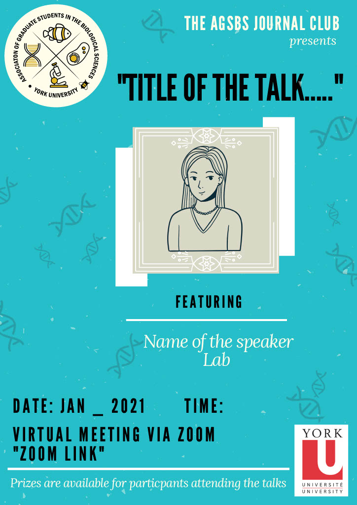

```{r setup, include=FALSE}
knitr::opts_chunk$set(echo = TRUE)
```

# York Biology Journal Club
<br>


<br>

## Hello!
The journal club committee invites you to get involved with the AGSBS Departmental Journal Club in 2021.
<br>

There will be eight monthly, one hour sessions between January and August and two student presenters per session. The sessions will be held online using Zoom, on the last Friday of each month at 12 pm. Each presenter has up to 30 minutes – present your own work with a question and answer session, or present a paper of your choice and lead a discussion – or any combination of the two! Each presenter will receive a gift card of their choice worth $20. In addition, here will be a prize raffle at the end of each session for three lucky attendees. Come out and support your fellow graduate students! <br>

We encourage all speakers to make their talks accessible and interesting to those in all areas of biology. We welcome talks on a very wide range of topics. For example, tell us about the project you are working on, or that new ground-breaking paper within your discipline. Lead a discussion on a controversial paper, a paper addressing science as a career choice or anything else! This is a supportive space for all graduate students!

<br>

## Sign up to be a Discussion Leader

Sign up as a presenter using this google form and send us an email if you have any questions. You do not need to have decided on a topic to sign up. [Sign up here!](
https://docs.google.com/forms/d/e/1FAIpQLSdAdlvA4kEKg68sLV6CCKkBobYLIipfGbs_FrUJab_jkkqqiQ/viewform?usp=sf_link)

<br>

Zoom links will be sent out via the Biograds listserve prior to the event. 

### Committee members
* Jenna Braun
* Malory Owen
* Cindy Tran
* Marjan Moallem
* David Miller